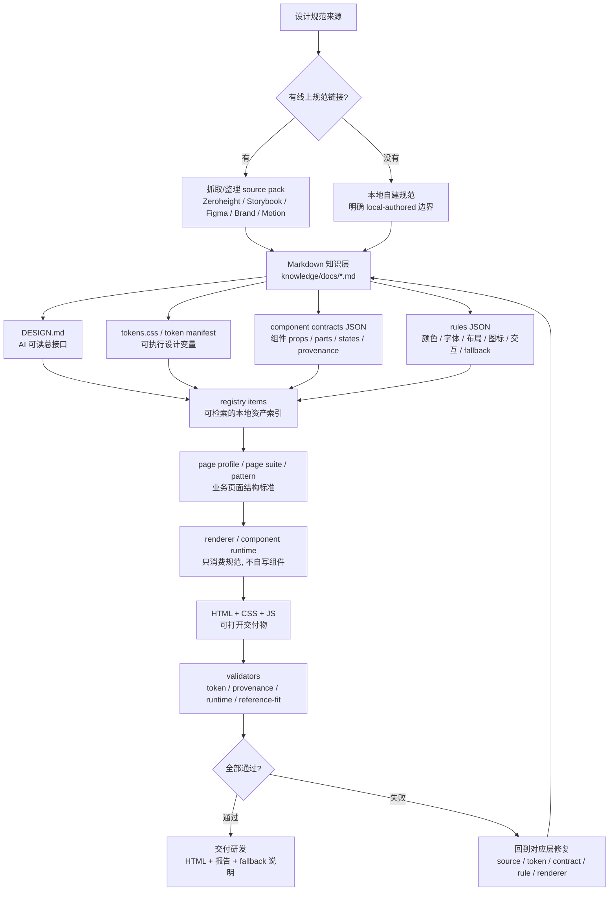

# 从设计规范到 HTML 交付教程

这份教程说明这个项目的完整设计思路：如何从设计规范链接开始，把设计系统沉淀成本地可消费的 `MD + JSON + token + contract + validator`，再生成可以交付研发的 HTML。

目标不是“让 AI 看几篇文档后自由发挥”，而是建立一条可复核的生产线：

```text
设计规范来源 -> 本地规范包 -> AI 可读接口 -> 规则和组件合同 -> 页面标准 -> HTML 渲染 -> 校验报告
```

## 一图流



## 第 1 步：获取设计规范链接

优先从真实设计系统拿来源，而不是让 AI 凭感觉生成。

常见来源：

- 设计规范站：Zeroheight、内部 Design System、品牌规范页。
- 组件文档：Storybook、组件 API 文档、组件 demo 页面。
- 设计稿：Figma 页面、组件库、页面参考图。
- 资产包：Logo、字体、图标、品牌图片。
- 业务参考：后台页面截图、表格样例、审批流、查询表单、消息待办等真实业务页面。

在本项目里，线上链接只是刷新来源；日常生成必须走本地文件。原因是线上页面可能需要登录、会改版、会加载失败，也可能只适合人看，不适合 renderer 直接消费。

如果没有线上规范链接，也可以本地自建，但必须讲清楚边界：

- `source_mode` 应标成 `local-authored` 或 `pending-capture`。
- 自建 token 只能作为本地假设，不能说成官方 token。
- 自建组件只能作为 local adapter 或 fallback，不能说成官方 runtime。
- 交付给研发前，要说明哪些内容后续需要映射到真实代码组件。

自建规范最大的代码适配风险是：视觉看起来像，但真实组件 API、交互状态、可访问性、键盘行为、弹层行为、表单校验和数据绑定可能不同。比如 Select 如果只是手写 HTML，就不能冒充真实组件；Table 如果没有官方 primitive，也必须明确是 fallback。

## 第 2 步：把来源沉淀成本地 source pack

把规范链接转换成本地可读文件，按来源类型分层保存。

推荐产物：

```text
design-system-plugin/design-system/knowledge/docs/*.md
design-system-plugin/design-system/knowledge/source-index.json
design-system-plugin/design-system/knowledge/docs-index.json
design-system-plugin/design-system/assets/brand/*
```

`MD` 负责承载人能读、AI 能读的说明。它要回答：

- 这个规范来自哪里。
- 适用于哪些组件或页面。
- 哪些内容已经抓取完整。
- 哪些内容是 pending capture。
- 哪些内容只是本地补充假设。

一个最小 `MD` 结构可以是：

```md
# Components / Select

Source:
- Storybook: <source-url>
- Zeroheight: <source-url>

Status:
- capture_state: captured
- source_mode: remote-captured

Rules:
- Select must expose trigger, value, listbox, option.
- Native visible select is not accepted for component-runtime output.

Implementation Notes:
- Official runtime is unavailable unless package access is verified.
- Local adapter must declare provenance and interaction states.
```

## 第 3 步：建立 DESIGN.md 总接口

`DESIGN.md` 不是普通说明文档，而是 AI 和 renderer 的上游接口。

它要告诉后续生成链路：

- 本地设计系统有哪些权威来源。
- token、组件、规则、页面 profile 分别从哪里读。
- 哪些远程链接只是 refresh source。
- 哪些组件可以走 runtime，哪些只能 fallback。
- 生成 HTML 前必须遵守哪些边界。

本项目的入口是：

```text
design-system-plugin/design-system/DESIGN.md
```

`DESIGN.md` 应该只做“总入口和边界定义”，不要把所有组件细节塞进去。组件细节放 contract，页面标准放 profile/rule，token 值放 CSS 和 manifest。

## 第 4 步：把设计变量变成可执行 token

`tokens.css` 负责让 HTML 真正可运行。它不是给 AI 看的描述，而是最终页面会引用的 CSS 变量。

推荐产物：

```text
design-system-plugin/design-system/tokens/tokens.css
design-system-plugin/design-system/tokens/token-manifest.json
design-system-plugin/design-system/contracts/semantic-token-map.json
```

token 要分清三层：

| 层级 | 作用 | 示例 |
|---|---|---|
| primitive token | 原始品牌值 | purple、gray、spacing、font size |
| semantic token | 页面语义 | accent、background、border、text |
| component token | 组件角色 | button background、input border、sidebar item |

生成 HTML 时优先用 semantic/component token，不要直接写 hex、RGB、HSL 或随手写 px。否则页面短期能看，长期无法跟随设计规范升级。

## 第 5 步：用 JSON 建组件合同、页面标准和规则

`JSON` 的作用是让规范变成机器可校验的结构。不要只写“按钮应该好看”，要写成 renderer 和 validator 都能读懂的合同。

### 组件合同

组件合同说明一个组件最小需要哪些结构、props、状态和来源。

推荐位置：

```text
design-system-plugin/design-system/contracts/components/*.contract.json
design-system-plugin/design-system/adapters/components/adapter-registry.json
design-system-plugin/design-system/atomic/components/*/*.package.json
```

一个组件合同至少要回答：

- component id 是什么。
- 来源是官方 runtime、本地 adapter、docs-backed primitive，还是 fallback。
- 支持哪些 size、variant、state。
- DOM parts 或 slot 是什么。
- 交互行为是什么：hover、focus、active、open、selected、disabled、keyboard。
- validator 如何证明它真的被消费。

### 页面标准

页面标准说明这个业务页面属于哪类工作流。

推荐位置：

```text
design-system-plugin/design-system/business/page-taxonomy.json
design-system-plugin/design-system/page-profiles/*.profile.json
design-system-plugin/design-system/page-suites/*.contract.json
design-system-plugin/design-system/patterns/*/*.pattern.json
```

后台页不要一律叫 dashboard。先判断页面族：

- 查询列表
- 审批流
- 数据填报表
- 详情页
- 表单页
- 信息聚合页
- 报表看板
- 权限管理
- 异常状态页

页面 profile 要定义布局、密度、必备模块、操作区、状态、滚动归属、表格/列表行为和 fallback 边界。

### 规则

规则是 validator 的输入。

推荐位置：

```text
design-system-plugin/design-system/rules/*.json
design-system-plugin/design-system/reference-fit/*.rules.json
design-system-plugin/design-system/policies/*.json
```

规则要覆盖：

- 颜色：不能硬编码色值，不能把绿色当默认主色。
- 字体：使用 Sanofi Sans / Noto Sans SC 和 tokenized typography。
- 布局：Container/Grid/PageHeader/Sidebar 是否成立。
- 图标：功能图标必须有来源、名称、尺寸和角色。
- 交互：hover、focus、active、open、selected 是否存在。
- fallback：Table、Chart、MessageList 等是否明确说明原因。
- reference-fit：截图级视觉验收，不被普通 validator 替代。

## 第 6 步：建立 registry-first 生产方式

AI 生成 HTML 前，应先查 registry，而不是重新扫描所有 Markdown 或临时打开网页。

推荐入口：

```text
design-system-plugin/components.json
design-system-plugin/design-system/registry/registry.json
design-system-plugin/design-system/registry/items/*.json
```

registry item 的价值是把来源、token、contract、pattern、validator 连接起来。这样 renderer 才知道“这个页面该用什么组件、什么规则、什么验证链”。

日常使用时先运行：

```bash
./sanofi-ds doctor
./sanofi-ds business standards
./sanofi-ds gap list
```

如果生成的是 OneOrbit 这类多页面组合，应增加 page suite，而不是复制多个孤立页面：

```text
design-system-plugin/design-system/page-suites/oneorbit-approval-suite.contract.json
```

## 第 7 步：建立验证体系

验证体系至少分三层。

### 结构验证

证明文件、registry、rule、profile 存在且能被读取。

常用命令：

```bash
./sanofi-ds doctor
design-system-plugin/scripts/validate-design-md
design-system-plugin/scripts/validate-local-registry
design-system-plugin/scripts/validate-business-standards
```

### 生成物验证

证明 HTML 没有偏离 token、component、runtime、provenance、layout 规则。

常用命令：

```bash
design-system-plugin/scripts/validate-token-usage <html-file>
design-system-plugin/scripts/validate-component-runtime <html-file>
design-system-plugin/scripts/validate-icon-usage <html-file>
design-system-plugin/scripts/validate-elevation-usage <html-file>
design-system-plugin/scripts/validate-page-layout-typography <html-file>
design-system-plugin/scripts/validate-provenance <html-file>
```

### 视觉和交互验证

证明页面不只是 validator 通过，还能在真实浏览器里交付。

常用命令：

```bash
design-system-plugin/scripts/validate-reference-fit <html-file>
design-system-plugin/scripts/measure-business-page-examples
design-system-plugin/scripts/measure-oneorbit-browser-metrics
```

重点检查：

- 1440 桌面没有贴边、重叠、横向溢出。
- Select、Tabs、DateRange、Sidebar、Button 等有真实交互状态。
- 可见控件不是原生控件伪装成组件。
- fallback 模块有明确原因。
- 报告里能列清组件名称、来源、布局依据和失败项。

## 最小落地清单

新建一个设计规范到 HTML 的生产链，最少需要这些文件：

```text
design-system-plugin/design-system/DESIGN.md
design-system-plugin/design-system/tokens/tokens.css
design-system-plugin/design-system/knowledge/docs/<source>.md
design-system-plugin/design-system/contracts/components/<component>.contract.json
design-system-plugin/design-system/rules/<rule>.json
design-system-plugin/design-system/page-profiles/<page>.profile.json
design-system-plugin/design-system/patterns/<page>/<page>.pattern.json
design-system-plugin/design-system/registry/items/<item>.json
design-system-plugin/scripts/validate-<rule-or-page>
design-system-plugin/outputs/html/<page>.resolved.html
design-system-plugin/outputs/reports/<validator>.report.json
```

如果要让这个链路稳定，需要再补：

- `components.json`：把入口命令、别名和产物位置暴露出来。
- `.cursor/rules/*.mdc`：让 Cursor 知道必须先读哪些本地文件。
- `install.sh`：让新用户一键完成 Cursor 项目安装和基础检查。
- `reference-fit`：把截图级视觉验收独立出来。

## 最重要的判断原则

1. 有规范链接时，先沉淀成本地 source pack，再生成。
2. 没有规范链接时，可以本地自建，但必须标注假设和代码适配风险。
3. `MD` 写语义和边界，`JSON` 写机器可校验合同，`tokens.css` 写可执行值。
4. renderer 只能消费规范，不应该临时手写组件并伪装成组件库。
5. validator pass 不是最终交付；还要有 reference-fit、浏览器交互和 fallback honesty。
6. 最终交付给研发时，必须同时交付 HTML、报告、组件来源表和 fallback 说明。
